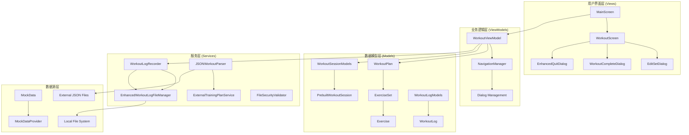

# Fit健身训练iOS应用 - 开发者导航地图

> **创建时间**: 2025-10-14
> **版本**: 1.0
> **架构分析师**: Claude System Architect

## 📋 项目概览

### 项目基本信息
- **项目类型**: iOS健身训练应用
- **架构模式**: MVVM + SwiftUI
- **最低支持版本**: iOS 15.0+
- **核心功能**: 训练计划执行、实时日志记录、外部数据导入

### 系统架构总览



## 🏗️ 系统架构导航

### 1. 用户界面层 (Views)

#### 核心视图组件
- **`WorkoutScreen.swift`** - 训练执行主界面
  - 功能: 实时训练执行、进度显示、弹窗管理
  - 关键依赖: `WorkoutViewModel`, `NavigationManager`
  - 弹窗集成: `EditSetDialog`, `EnhancedQuitDialog`

- **`MainScreen.swift`** - 主界面
  - 功能: 训练计划选择、应用入口
  - 关键依赖: `MockDataProvider`, `NavigationManager`

#### 弹窗系统 (`Views/Dialogs/`)
- **`EditSetDialog.swift`** - 动作完成参数编辑
  - 触发条件: 用户点击"动作完成"
  - 数据流: 用户输入 → `WorkoutViewModel.completeExerciseWith()` → 状态更新
  - 验证逻辑: 次数和重量格式验证

- **`EnhancedQuitDialog.swift`** - 放弃训练选项
  - 选项类型: 跳过当前动作/放弃全部训练/继续训练
  - 状态管理: 通过`NavigationManager`统一管理

### 2. 业务逻辑层 (ViewModels)

#### 核心ViewModel
- **`WorkoutViewModel.swift`** - 训练状态管理核心
  - **关键状态**:
    - `currentExerciseIndex`: 当前练习索引
    - `currentSet`: 当前组数
    - `exerciseElapsedTime`: 动作执行时间
    - `isResting`: 休息状态标识
    - `completedSets`: 已完成组数列表
    - `workoutSession`: 预建立训练会话数据结构

  - **核心方法**:
    - `startExercise()`: 开始练习计时
    - `completeExerciseWith()`: 完成练习并记录参数
    - `skipCurrentExerciseCompletely()`: 跳过整个练习
    - `finishWorkoutAndSaveLog()`: 完成训练并保存日志

#### 导航管理
- **`NavigationManager.swift`** - 全局导航和状态管理
  - **核心功能**:
    - 屏幕导航栈管理
    - 弹窗状态管理 (`presentedDialog`)
    - WorkoutViewModel生命周期管理
    - 训练完成流程协调

### 3. 数据模型层 (Models)

#### 核心数据结构
- **`WorkoutSessionModels.swift`** - 预建立训练会话架构
  - `PrebuiltWorkoutSession`: 完整训练会话数据容器
  - `ExerciseSession`: 单个练习的会话数据
  - `WorkoutSet`: 单个训练组的数据结构
  - `PrebuiltWorkoutSessionPrebuilder`: 预建立数据结构构建器

- **`WorkoutLogModels.swift`** - 训练日志数据模型
  - `WorkoutLogEntry`: 单条训练记录
  - `WorkoutLog`: 完整训练日志
  - `WorkoutValue`: 处理实际值或N/A的枚举
  - `EnhancedWorkoutLogFileManager`: 日志文件管理器

- **`MockData.swift`** - 示例数据和核心模型定义
  - `Exercise`: 练习基础模型
  - `ExerciseSet`: 练习组配置
  - `WorkoutPlan`: 训练计划
  - `MockDataProvider`: 示例数据提供者

### 4. 服务层 (Services)

#### 核心服务组件
- **`WorkoutLogRecorder.swift`** - 训练日志记录服务
  - **功能**:
    - 实时训练数据记录
    - 练习切换和组数管理
    - 训练时长统计
    - 日志文件生成和保存

- **`JSONWorkoutParser.swift`** - 外部数据解析服务
  - **功能**:
    - JSON格式训练计划解析
    - 智能练习属性推断
    - 数据格式验证
    - 错误处理和报告

- **`ExternalTrainingPlanService.swift`** - 外部文件导入服务
- **`FileSecurityValidator.swift`** - 文件安全验证服务

## 🔄 数据流分析

### 核心数据流向

#### 1. 训练计划加载流程
```
MockDataProvider → NavigationManager.startWorkout()
→ WorkoutViewModel.init()
→ PrebuiltWorkoutSessionPrebuilder.buildSession()
→ WorkoutScreen显示
```

#### 2. 训练执行数据流
```
用户操作(开始/完成/跳过)
→ WorkoutViewModel方法调用
→ 预建立数据结构状态更新
→ WorkoutLogRecorder记录
→ UI状态更新
```

#### 3. 训练日志生成流程
```
WorkoutViewModel.completeExerciseWith()
→ WorkoutLogRecorder.recordCompletedSet()
→ 训练完成时 finishWorkout()
→ EnhancedWorkoutLogFileManager.saveWorkoutLog()
→ 本地文件系统存储
```

#### 4. 外部数据导入流程
```
文件选择 → FileSecurityValidator验证
→ JSONWorkoutParser解析
→ MockDataProvider数据更新
→ NavigationManager.startWorkout()
```

### 关键数据依赖关系
- `WorkoutViewModel` 依赖 `PrebuiltWorkoutSession` 进行进度计算
- `WorkoutLogRecorder` 与 `WorkoutViewModel` 同步训练状态
- `NavigationManager` 管理 `WorkoutViewModel` 的生命周期
- `EditSetDialog` 通过 `WorkoutViewModel` 更新训练数据

## 🎨 设计模式识别

### 1. MVVM架构模式 (Model-View-ViewModel)
- **应用层级**: 全局架构模式
- **实现特点**:
  - Views: 纯UI组件，通过`@EnvironmentObject`绑定ViewModel
  - ViewModels: 业务逻辑中心，管理状态和数据流
  - Models: 纯数据结构，无业务逻辑
- **优势**: 清晰的职责分离，便于测试和维护

### 2. 观察者模式 (Observer Pattern)
- **应用场景**: `@Published`属性与`@EnvironmentObject`
- **实现机制**: SwiftUI的响应式数据绑定
- **关键组件**: `WorkoutViewModel`的发布属性，Views的自动更新

### 3. 建造者模式 (Builder Pattern)
- **应用场景**: `PrebuiltWorkoutSessionPrebuilder`
- **实现特点**: 分步骤构建复杂的训练会话数据结构
- **优势**: 复杂对象构建过程的封装和验证

### 4. 单例模式 (Singleton Pattern)
- **应用场景**: `MockDataProvider.shared`, `FileManager.default`
- **实现特点**: 全局数据访问点，生命周期管理
- **风险评估**: 无状态冲突，使用安全

### 5. 策略模式 (Strategy Pattern)
- **应用场景**: `JSONWorkoutParser`的智能推断方法
- **实现特点**: 根据不同输入采用不同的数据构建策略

## 🚀 开发者导航指南

### 快速定位功能代码

#### 1. 训练执行相关
- **训练开始**: `WorkoutViewModel.startExercise()`
- **训练完成**: `WorkoutViewModel.completeExerciseWith()`
- **进度计算**: `WorkoutViewModel.progress` (computed property)
- **计时管理**: `startExerciseTimer()`, `startRestTimer()`

#### 2. 弹窗系统相关
- **弹窗触发**: `NavigationManager.presentDialog()`
- **动作编辑**: `EditSetDialog.saveChanges()`
- **训练完成**: `NavigationManager.completeWorkout()`

#### 3. 数据持久化相关
- **日志记录**: `WorkoutLogRecorder.recordCompletedSet()`
- **文件保存**: `EnhancedWorkoutLogFileManager.saveWorkoutLog()`
- **数据解析**: `JSONWorkoutParser.parseWorkoutPlan()`

#### 4. UI组件相关
- **训练界面**: `WorkoutScreen.swift`
- **信息卡片**: `CompactExerciseInfoCard`
- **计时模块**: `CompactTimerView`

### 扩展开发指导

#### 1. 添加新的训练类型
```swift
// 1. 在MockData.swift中添加新的ExerciseCategory
enum ExerciseCategory: String, Codable, CaseIterable {
    // 现有类别...
    case newCategory = "New Category"
}

// 2. 在JSONWorkoutParser中更新智能推断逻辑
private func determineExerciseCategory(_ exerciseName: String) -> ExerciseCategory {
    // 现有逻辑...
    if lowercasedName.contains("新动作关键词") {
        return .newCategory
    }
}

// 3. 在UI中添加对应的视觉样式
```

#### 2. 添加新的弹窗类型
```swift
// 1. 在NavigationManager中扩展DialogType
enum DialogType: Identifiable, Equatable {
    // 现有弹窗类型...
    case newDialog(parameters)
}

// 2. 在WorkoutScreen中添加弹窗显示逻辑
switch dialog {
case .newDialog(let params):
    NewDialog(params: params, onDismiss: { navigationManager.dismissDialog() })
}

// 3. 创建对应的弹窗组件
struct NewDialog: View {
    // 弹窗实现
}
```

#### 3. 扩展训练日志功能
```swift
// 1. 在WorkoutLogModels.swift中扩展数据结构
struct WorkoutLogEntry: Codable {
    // 现有字段...
    var newMetric: Double?  // 新增指标
}

// 2. 在WorkoutLogRecorder中添加记录逻辑
func recordNewMetric(_ value: Double) {
    // 记录新指标
}

// 3. 在WorkoutViewModel中集成调用
func recordAdditionalMetrics() {
    workoutLogRecorder.recordNewMetric(newValue)
}
```

## ⚠️ 设计陷阱与最佳实践

### 当前架构优势
1. **清晰的职责分离**: MVVM模式确保各组件职责明确
2. **响应式数据流**: SwiftUI的响应式特性简化状态管理
3. **预建立数据结构**: `PrebuiltWorkoutSession`提供稳定的数据基础
4. **统一的导航管理**: `NavigationManager`集中处理界面状态

### 潜在设计陷阱

#### 1. 过度复杂的ViewModel
- **问题**: `WorkoutViewModel`承担过多职责（计时、进度、日志、导航）
- **建议**: 考虑拆分为专门的`WorkoutTimer`和`WorkoutProgress`组件

#### 2. 强耦合的弹窗系统
- **问题**: 弹窗直接依赖具体的ViewModel实例
- **建议**: 使用协议抽象，降低弹窗与ViewModel的耦合度

#### 3. 数据同步复杂性
- **问题**: `completedSets`和`workoutSession`需要手动同步
- **建议**: 实现单一数据源原则，通过`workoutSession`作为唯一状态源

#### 4. 文件系统依赖
- **问题**: 直接依赖本地文件系统，难以测试
- **建议**: 抽象文件存储接口，支持依赖注入

### 重构建议优先级

#### 高优先级 (立即处理)
1. **ViewModel职责拆分**: 将计时逻辑提取到独立组件
2. **数据一致性优化**: 统一`completedSets`和`workoutSession`的状态管理

#### 中优先级 (短期规划)
1. **弹窗系统解耦**: 实现弹窗协议抽象
2. **错误处理增强**: 添加全局错误处理机制

#### 低优先级 (长期优化)
1. **文件存储抽象**: 实现可测试的存储接口
2. **性能优化**: 大量训练数据的内存管理优化

## 📚 技术债务清单

### 已识别的技术债务
1. **循环依赖风险**: MockDataProvider中的延迟初始化机制
2. **状态同步复杂**: 多个数据源需要手动同步
3. **测试覆盖不足**: 业务逻辑缺少单元测试
4. **内存管理**: 计时器的生命周期管理需要优化

### 建议的解决策略
1. **引入依赖注入**: 降低组件间的直接依赖
2. **实现Repository模式**: 统一数据访问接口
3. **添加单元测试**: 提高代码质量和可维护性
4. **性能监控**: 添加内存使用和性能指标监控

---

## 🔗 相关文档索引

- **API文档**: `Models/`目录下的数据结构定义
- **UI组件库**: `Views/`目录下的SwiftUI组件
- **服务接口**: `Services/`目录下的业务服务
- **配置文件**: 项目根目录下的配置和设置

> **注**: 本文档将随项目演进持续更新，建议定期检查最新版本。