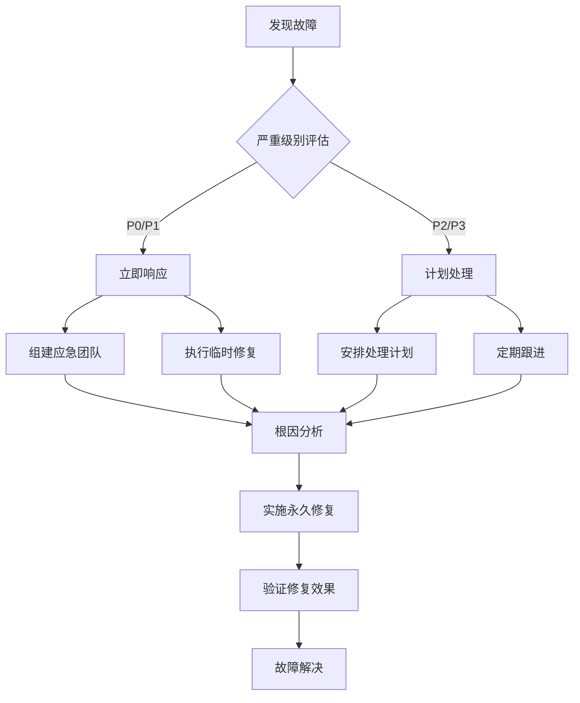

# CI/CD 故障排除手册

//created by Jason Lu on 09:17:00 10/12/2025

## 📋 概述

本手册提供了Fit项目CI/CD流程中常见问题的诊断和解决方案，帮助开发团队快速定位和解决构建、测试和部署问题。

## 🔧 常见CI/CD问题

### 1. 构建失败问题

#### 问题1：Swift编译错误

**症状描述**：
```
error: 'xxx' is unavailable: cannot be synthesized in an enum with raw type 'String'
error: cannot find 'xxx' in scope
error: value of type 'xxx' has no member 'yyy'
```

**诊断步骤**：
1. 检查错误日志中的具体文件和行号
2. 确认Xcode版本兼容性
3. 检查Swift语言版本设置
4. 验证依赖库版本

**解决方案**：
```bash
# 1. 清理构建缓存
rm -rf ~/Library/Developer/Xcode/DerivedData
rm -rf .build

# 2. 重新生成项目文件
xcodegen generate # 如果使用xcodegen

# 3. 更新依赖
pod update
# 或
swift package update

# 4. 检查Xcode设置
# 在Xcode中检查：Build Settings -> Swift Language Version
```

**预防措施**：
- 在本地运行完整构建验证
- 使用相同的Xcode版本
- 定期更新依赖库版本

#### 问题2：链接错误

**症状描述**：
```
ld: library not found for -lxxx
ld: symbol(s) not found for architecture arm64
ld: 1 duplicate symbol for architecture arm64
```

**诊断步骤**：
1. 检查链接器错误日志
2. 确认目标架构设置
3. 检查依赖库配置
4. 验证符号冲突

**解决方案**：
```bash
# 1. 检查架构设置
xcodebuild -showBuildSettings | grep ARCHS

# 2. 清理并重新构建
xcodebuild clean
xcodebuild build

# 3. 检查链接库设置
# 在Xcode中检查：Build Settings -> Other Linker Flags

# 4. 解决符号冲突
# 使用 nm 命令检查符号冲突
nm -U ./build/libFit.a | grep 'duplicate_symbol'
```

**预防措施**：
- 使用静态分析工具检查符号冲突
- 定期清理构建产物
- 维护一致的构建配置

#### 问题3：依赖管理问题

**症状描述**：
```
error: No such module 'xxx'
warning: Unable to find a match for xxx in any dependency target
error: Multiple commands produce
```

**诊断步骤**：
1. 检查Package.swift或Podfile配置
2. 验证依赖版本兼容性
3. 检查缓存状态
4. 确认网络连接

**解决方案**：
```bash
# Swift Package Manager
# 1. 重置包缓存
swift package reset

# 2. 重新解析依赖
swift package resolve

# 3. 更新依赖
swift package update

# CocoaPods
# 1. 清理缓存
pod cache clean --all

# 2. 重新安装
pod deintegrate
pod install

# 3. 更新依赖
pod update
```

**预防措施**：
- 锁定依赖版本
- 使用依赖管理工具的版本锁定功能
- 定期更新依赖并测试

### 2. 测试失败问题

#### 问题1：单元测试失败

**症状描述**：
```
Test Suite 'xxxTests' failed at xxx
Assertion Failure: xxx: xxx
Test Case '-[xxx xxx]' failed (xxx seconds)
```

**诊断步骤**：
1. 查看测试失败的具体信息
2. 在本地复现失败的测试
3. 检查测试环境和数据
4. 验证测试依赖

**解决方案**：
```bash
# 1. 在本地运行失败测试
xcodebuild test \
  -scheme Fit \
  -destination 'platform=iOS Simulator,name=iPhone 15' \
  -only-testing:FitTests/FailedTestClass/testFailedMethod

# 2. 启用详细日志
xcodebuild test \
  -scheme Fit \
  -destination 'platform=iOS Simulator,name=iPhone 15' \
  -enableCodeCoverage YES \
  -verbose

# 3. 检查测试数据
# 确保测试数据在CI环境中可用
# 清理并重新创建测试数据
```

**修复策略**：
- 更新测试逻辑
- 修正测试数据
- 增加测试容错性
- 改进测试环境配置

#### 问题2：UI测试失败

**症状描述**：
```
Test Case '-[xxxUITests xxx]' failed.
UI Testing Failure: Failed to find element matching...
Timeout:等待元素出现超时
Assertion Failure: <unknown>
```

**诊断步骤**：
1. 检查UI测试的元素定位
2. 验证模拟器配置
3. 检查UI测试的等待策略
4. 确认应用启动状态

**解决方案**：
```swift
// 1. 增加等待策略
let app = XCUIApplication()
app.launch()

// 等待元素出现
let button = app.buttons["开始训练"]
let exists = button.waitForExistence(timeout: 10.0)
XCTAssertTrue(exists, "按钮未在预期时间内出现")

// 2. 改进元素定位
// 使用更具体的定位策略
app.buttons["开始训练"].tap()
app.textFields["重量输入"].tap()

// 3. 添加重试机制
func tapButtonWithRetry(button: XCUIElement, maxRetries: Int = 3) {
    for _ in 0..<maxRetries {
        if button.exists {
            button.tap()
            return
        }
        sleep(1)
    }
    XCTFail("按钮在重试\(maxRetries)次后仍不可用")
}
```

**预防措施**：
- 使用稳定的元素定位策略
- 实现合理的等待机制
- 定期更新UI测试
- 监控应用界面变化

#### 问题3：测试环境问题

**症状描述**：
```
Unable to install app on device
Simulator not responding
Device not found
```

**诊断步骤**：
1. 检查模拟器状态
2. 验证设备配置
3. 检查网络连接
4. 查看系统资源使用

**解决方案**：
```bash
# 1. 重置模拟器
xcrun simctl erase all
xcrun simctl shutdown all
xcrun simctl boot "iPhone 15"

# 2. 检查可用设备
xcrun simctl list devices

# 3. 清理模拟器缓存
rm -rf ~/Library/Developer/CoreSimulator/Devices

# 4. 重新启动模拟器
xcrun simctl boot "iPhone 15"
```

### 3. 部署失败问题

#### 问题1：TestFlight上传失败

**症状描述**：
```
ERROR: Unable to upload app
ERROR: Invalid binary
ERROR: Missing required metadata
```

**诊断步骤**：
1. 检查应用签名配置
2. 验证应用元数据
3. 确认开发者账户状态
4. 检查网络连接

**解决方案**：
```bash
# 1. 验证应用签名
codesign -dv ./build/Fit.ipa
codesign --verify --verbose ./build/Fit.ipa

# 2. 检查应用元数据
xcrun altool --validate-app \
  --type ios \
  --file ./build/Fit.ipa \
  --asc-provider <ProviderShortName> \
  --username <AppleID> \
  --password <AppPassword>

# 3. 重新创建Provisioning Profile
# 在Apple Developer Portal中重新创建并下载

# 4. 重新导出应用
xcodebuild -exportArchive \
  -archivePath ./build/Fit.xcarchive \
  -exportPath ./build/ \
  -exportOptionsPlist ExportOptions.plist
```

#### 问题2：App Store审核失败

**症状描述**：
```
Guideline 2.1 - App Completeness
Guideline 4.0 - Design
Metadata Rejected
Binary Rejected
```

**诊断步骤**：
1. 仔细阅读审核指南
2. 对比应用与指南要求
3. 检查应用元数据
4. 验证应用功能

**解决方案**：
```swift
// 1. 检查应用完整性
// 确保所有功能都可以正常访问
// 添加加载状态和错误处理

// 2. 改进用户界面
// 遵循Apple设计指南
// 确保界面美观且易用

// 3. 完善应用元数据
// 更新应用描述和关键词
// 添加准确的截图和预览

// 4. 修复功能性bug
// 解决所有崩溃问题
// 确保应用在所有支持的设备上正常运行
```

## 🔍 调试工具和技巧

### 1. 日志分析

#### Xcode构建日志
```bash
# 生成详细构建日志
xcodebuild clean build \
  -project Fit.xcodeproj \
  -scheme Fit \
  -destination 'platform=iOS Simulator,name=iPhone 15' \
  > build.log 2>&1

# 分析构建日志
grep -E "(error|warning)" build.log
```

#### GitHub Actions日志
```yaml
# 在GitHub Actions中启用详细日志
- name: Debug Build
  run: |
    set -x  # 启用命令追踪
    xcodebuild -version
    xcodebuild -showsdks
    xcodebuild build \
      -project Fit.xcodeproj \
      -scheme Fit \
      -destination 'platform=iOS Simulator,name=iPhone 15'
```

### 2. 性能分析

#### 构建时间分析
```bash
# 使用xcodebuild-analyzer
xcodebuild-analyzer \
  -project Fit.xcodeproj \
  -scheme Fit \
  -destination 'platform=iOS Simulator,name=iPhone 15'

# 或者使用Time Profiler
xcodebuild \
  -project Fit.xcodeproj \
  -scheme Fit \
  -destination 'platform=iOS Simulator,name=iPhone 15' \
  OTHER_SWIFT_FLAGS="-Xfrontend -time-profile"
```

#### 内存使用分析
```bash
# 在测试中监控内存使用
xcodebuild test \
  -scheme Fit \
  -destination 'platform=iOS Simulator,name=iPhone 15' \
  -resultBundlePath ./TestResults.xcresult

# 使用xcrun xcresulttool分析结果
xcrun xcresulttool get \
  --format json \
  --path ./TestResults.xcresult
```

### 3. 自动化调试脚本

#### 构建诊断脚本
```bash
#!/bin/bash
# build-diagnosis.sh

echo "🔍 开始构建诊断..."

# 检查Xcode版本
echo "📱 Xcode版本："
xcodebuild -version

# 检查项目配置
echo "⚙️ 项目配置："
xcodebuild -project Fit.xcodeproj -list

# 检查构建设置
echo "🛠️ 构建设置："
xcodebuild -showBuildSettings -project Fit.xcodeproj -scheme Fit

# 检查依赖
echo "📦 依赖检查："
if [ -f "Package.swift" ]; then
    swift package dump-package
elif [ -f "Podfile" ]; then
    pod list
fi

# 清理构建
echo "🧹 清理构建..."
xcodebuild clean
rm -rf ~/Library/Developer/Xcode/DerivedData

# 尝试构建
echo "🔨 尝试构建..."
xcodebuild build \
  -project Fit.xcodeproj \
  -scheme Fit \
  -destination 'platform=iOS Simulator,name=iPhone 15'

echo "✅ 诊断完成"
```

#### 测试诊断脚本
```bash
#!/bin/bash
# test-diagnosis.sh

echo "🧪 开始测试诊断..."

# 检查模拟器状态
echo "📱 模拟器状态："
xcrun simctl list devices

# 重置模拟器
echo "🔄 重置模拟器..."
xcrun simctl erase all

# 启动模拟器
echo "🚀 启动模拟器..."
xcrun simctl boot "iPhone 15"

# 等待模拟器就绪
sleep 10

# 运行测试
echo "🧪 运行测试..."
xcodebuild test \
  -project Fit.xcodeproj \
  -scheme Fit \
  -destination 'platform=iOS Simulator,name=iPhone 15' \
  -enableCodeCoverage YES

echo "✅ 测试诊断完成"
```

## 📊 监控和告警

### 1. CI/CD监控指标

#### 构建指标
- **构建成功率**：> 95%
- **构建时间**：< 10分钟
- **失败恢复时间**：< 30分钟

#### 测试指标
- **测试通过率**：> 90%
- **测试覆盖率**：> 80%
- **测试执行时间**：< 5分钟

#### 部署指标
- **部署成功率**：> 98%
- **部署时间**：< 15分钟
- **回滚时间**：< 5分钟

### 2. 告警配置

#### Slack通知
```yaml
# .github/workflows/notify.yml
- name: Notify on Failure
  if: failure()
  uses: 8398a7/action-slack@v3
  with:
    status: failure
    channel: '#ci-cd-alerts'
    webhook_url: ${{ secrets.SLACK_WEBHOOK }}
```

#### 邮件通知
```yaml
# .github/workflows/email.yml
- name: Send Email on Failure
  if: failure()
  uses: dawidd6/action-send-mail@v3
  with:
    server_address: smtp.gmail.com
    server_port: 587
    username: ${{ secrets.EMAIL_USERNAME }}
    password: ${{ secrets.EMAIL_PASSWORD }}
    subject: "Fit CI/CD Failure"
    body: |
      构建失败！
      分支：${{ github.ref }}
      提交：${{ github.sha }}
      作者：${{ github.actor }}
    to: ${{ secrets.NOTIFICATION_EMAIL }}
```

## 🛠️ 优化建议

### 1. 构建优化

#### 并行化构建
```yaml
# GitHub Actions并行化
jobs:
  build-and-test:
    runs-on: macos-latest
    strategy:
      matrix:
        destination:
          - 'platform=iOS Simulator,name=iPhone 15'
          - 'platform=iOS Simulator,name=iPhone 14'
          - 'platform=iOS Simulator,name=iPhone SE (3rd generation)'

    steps:
    - uses: actions/checkout@v3
    - name: Build and Test
      run: |
        xcodebuild test \
          -project Fit.xcodeproj \
          -scheme Fit \
          -destination ${{ matrix.destination }}
```

#### 缓存策略
```yaml
# GitHub Actions缓存
- name: Cache Build Artifacts
  uses: actions/cache@v3
  with:
    path: |
      ~/Library/Developer/Xcode/DerivedData
      .build
    key: ${{ runner.os }}-xcode-${{ hashFiles('**/*.swift') }}
    restore-keys: |
      ${{ runner.os }}-xcode-
```

### 2. 测试优化

#### 智能测试选择
```bash
# 只运行变更相关的测试
git diff --name-only origin/main...HEAD | grep '\.swift$' | \
  xargs -I {} sh -c 'xcodebuild test -only-testing:FitTests/$(basename {} .swift)Tests'

# 或者使用测试分类
xcodebuild test \
  -scheme Fit \
  -only-testing:FitTests/UnitTests \
  -only-testing:FitTests/IntegrationTests
```

#### 并行测试执行
```yaml
# 并行执行不同类型的测试
jobs:
  unit-tests:
    runs-on: macos-latest
    steps:
    - name: Run Unit Tests
      run: xcodebuild test -only-testing:FitTests/UnitTests

  ui-tests:
    runs-on: macos-latest
    steps:
    - name: Run UI Tests
      run: xcodebuild test -only-testing:FitUITests
```

### 3. 部署优化

#### 自动化部署策略
```yaml
# 自动化部署到TestFlight
- name: Deploy to TestFlight
  if: startsWith(github.ref, 'refs/tags/v')
  run: |
    # 自动部署逻辑
    echo "Deploying to TestFlight..."
```

#### 部署验证
```bash
# 部署后验证脚本
#!/bin/bash
# post-deploy-verification.sh

echo "🔍 开始部署验证..."

# 检查应用是否可用
if curl -f "https://api.fitapp.com/health"; then
    echo "✅ API健康检查通过"
else
    echo "❌ API健康检查失败"
    exit 1
fi

# 检查关键功能
# 这里可以添加更多的自动化验证步骤

echo "✅ 部署验证完成"
```

## 📋 故障响应流程

### 1. 故障分类

#### 严重级别
- **P0**：生产服务中断
- **P1**：核心功能不可用
- **P2**：次要功能问题
- **P3**：性能或优化问题

### 2. 响应时间要求

| 严重级别 | 响应时间 | 解决时间 |
|---------|---------|---------|
| P0 | 15分钟 | 2小时 |
| P1 | 30分钟 | 4小时 |
| P2 | 2小时 | 24小时 |
| P3 | 1天 | 3天 |

### 3. 故障处理流程



## 📚 知识库维护

### 1. 问题记录模板

```markdown
## 问题描述

**时间**：2025-10-12 14:30
**影响范围**：CI/CD构建失败
**严重级别**：P1

## 故障现象

[详细描述故障现象和影响]

## 根本原因

[分析问题的根本原因]

## 解决方案

[详细说明解决方案和实施步骤]

## 预防措施

[说明如何预防类似问题再次发生]

## 经验教训

[总结经验教训和改进建议]
```

### 2. 知识分享机制

- **每周技术分享**：分享故障处理经验
- **月度复盘会议**：回顾和分析重大故障
- **文档更新**：及时更新故障处理文档
- **培训计划**：定期进行团队培训

---

这份CI/CD故障排除手册为Fit项目提供了全面的故障诊断和解决方案，帮助团队快速响应和解决各种技术问题，确保开发流程的稳定性。