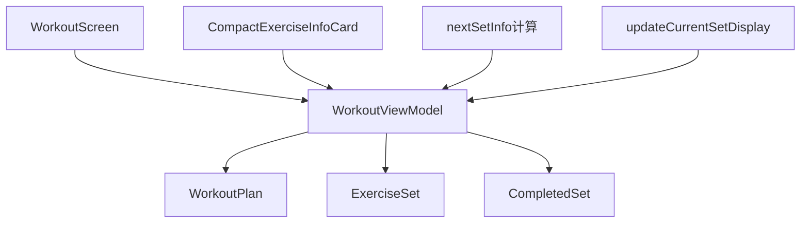
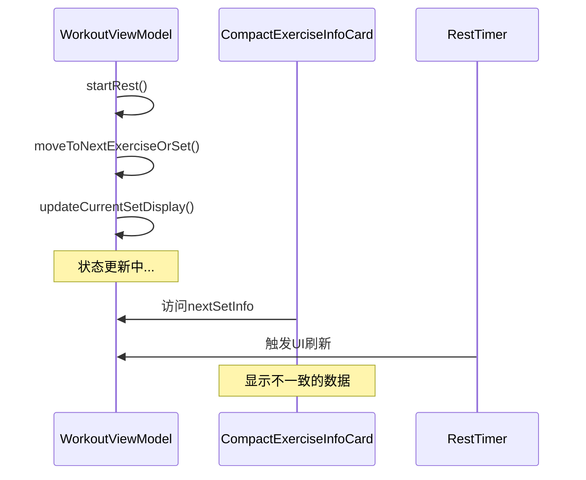

# iOS健身应用架构分析报告

//created by Jason Lu on 10:30:00 10/15/2025

## 执行摘要

本报告分析了iOS健身应用的架构设计，重点关注导致"下一组"显示错误信息的数据流和状态管理问题。通过系统性分析，识别了当前架构的关键问题并提供了改进建议。

## 当前架构概述

### 1. 架构模式
- **MVVM架构**：使用SwiftUI的ObservableObject模式
- **单向数据流**：ViewModel → View的数据绑定
- **响应式更新**：@Published属性触发UI刷新

### 2. 核心组件


## 架构问题分析

### 1. 数据流架构问题

#### 问题1：状态更新时序混乱
**位置**：`WorkoutViewModel.startRest()` → `moveToNextExerciseOrSet()` → `updateCurrentSetDisplay()`

**问题描述**：
```swift
// 在startRest()中的执行顺序
DispatchQueue.main.async {
    self.isResting = true
    self.isExerciseActive = false
    self.timeLeft = self.currentExerciseSet.restTime

    // 问题：先更新索引，再更新显示
    self.moveToNextExerciseOrSet()  // 这里会更新currentExerciseIndex
    self.startRestTimer()
}
```

**根本原因**：
- `currentExerciseIndex`更新与`currentSet`更新之间存在时序竞争
- `nextSetInfo`计算依赖过时的状态数据
- SwiftUI视图刷新时机不确定

#### 问题2：计算属性数据依赖不一致
**位置**：`CompactExerciseInfoCard.nextSetInfo`

**问题描述**：
```swift
private var nextSetInfo: String? {
    let allExercises = workoutViewModel.workoutPlan.exercises
    let currentExerciseIndex = allExercises.firstIndex(where: { $0.exercise.name == exercise.name }) ?? 0

    // 问题：使用exercise.name匹配而不是当前状态
    if currentSet < totalSets {
        if currentSet < allExerciseSets.count {
            let nextSet = allExerciseSets[currentSet] // 可能使用过时的索引
        }
    }
}
```

**根本原因**：
- 混合使用不同数据源（exercise.name vs currentExerciseIndex）
- 缺乏原子性状态更新
- 计算时机不确定

### 2. 状态管理模式问题

#### 问题1：状态分散管理
**问题现象**：
```swift
// 状态分散在多个@Published属性中
@Published var currentExerciseIndex: Int = 0
@Published var currentSet: Int = 1
@Published var exerciseElapsedTime: Int = 0
@Published var isExerciseActive: Bool = false
@Published var isResting: Bool = false
@Published var timeLeft: Int = 0
@Published var completedSets: [CompletedSet] = []
```

**分析**：
- 缺乏统一的状态管理机制
- 状态更新缺乏事务性
- 难以保证状态一致性

#### 问题2：异步操作协调不当
**位置**：`startRestTimer()`中的异步更新

**问题描述**：
```swift
DispatchQueue.main.async {
    self.restTimer = Timer.scheduledTimer(withTimeInterval: 1.0, repeats: true) { [weak self] timer in
        DispatchQueue.main.async {
            if self.timeLeft > 0 {
                self.timeLeft -= 1
            } else {
                timer.invalidate()
                self.restTimer = nil
                self.isResting = false
                self.startExercise() // 可能导致状态不一致
            }
        }
    }
}
```

### 3. UI组件通信问题

#### 问题1：视图刷新时机不确定
**现象**：
- `objectWillChange.send()`手动触发
- 多处`DispatchQueue.main.async`调用
- 缺乏明确的UI更新策略

#### 问题2：计算属性缓存问题
**位置**：`nextSetInfo`计算逻辑

**问题**：
```swift
private var nextSetInfo: String? {
    // 每次访问都重新计算，但依赖的状态可能不一致
    let allExercises = workoutViewModel.workoutPlan.exercises
    let currentExerciseIndex = allExercises.firstIndex(where: { $0.exercise.name == exercise.name }) ?? 0
}
```

## 根本原因分析

### 1. 架构设计缺陷

#### 缺乏统一状态管理
当前架构采用分散的@Published属性，缺乏：
- 状态更新的原子性
- 状态转换的明确规则
- 状态一致性保证机制

#### 数据流复杂度高
- 多个状态属性相互依赖
- 异步操作穿插在状态更新中
- 计算属性依赖链不清晰

### 2. 时序问题

#### 状态更新竞争


#### 异步操作协调不当
- Timer回调与用户操作并发
- 多个DispatchQueue.main.async调用
- 缺乏状态更新的同步机制

## 架构改进建议

### 1. 短期修复方案

#### 修复状态更新时序
```swift
// 建议的修复方案
private func moveToNextExerciseOrSet() {
    // 原子性状态更新
    DispatchQueue.main.async {
        let previousIndex = self.currentExerciseIndex

        if self.currentExerciseIndex < self.workoutPlan.exercises.count - 1 {
            self.currentExerciseIndex += 1

            // 确保状态同步更新
            self.updateCurrentSetDisplay()

            // 强制触发UI更新
            self.objectWillChange.send()
        }
    }
}
```

#### 改进nextSetInfo计算
```swift
private var nextSetInfo: String? {
    // 使用统一的状态源
    let currentIndex = workoutViewModel.currentExerciseIndex
    let currentSet = workoutViewModel.currentSet
    let allExercises = workoutViewModel.workoutPlan.exercises

    // 基于当前状态进行计算
    if currentIndex < allExercises.count {
        let currentExercise = allExercises[currentIndex].exercise
        let exerciseSets = allExercises.filter { $0.exercise.id == currentExercise.id }

        if currentSet < exerciseSets.count {
            // 显示同一练习的下一组
            return calculateNextSetInfo(for: exerciseSets, at: currentSet)
        } else if currentIndex < allExercises.count - 1 {
            // 显示下一个练习
            return calculateNextExerciseInfo(at: currentIndex)
        }
    }

    return nil
}
```

### 2. 长期架构优化

#### 引入状态机模式
```swift
enum WorkoutState {
    case notStarted
    case exerciseInProgress(exerciseIndex: Int, setIndex: Int)
    case resting(nextExerciseIndex: Int, nextSetIndex: Int)
    case completed
    case paused
}

class WorkoutStateMachine {
    @Published var currentState: WorkoutState = .notStarted

    func transition(to newState: WorkoutState) {
        // 状态转换逻辑
        // 确保状态转换的原子性和一致性
    }
}
```

#### 实现统一数据流
```swift
class WorkoutViewModel: ObservableObject {
    @Published var workoutState: WorkoutState = .notStarted

    // 简化的状态计算
    var currentExercise: Exercise {
        switch workoutState {
        case .exerciseInProgress(let exerciseIndex, _):
            return workoutPlan.exercises[exerciseIndex].exercise
        default:
            return workoutPlan.exercises[0].exercise
        }
    }

    var nextSetInfo: String? {
        switch workoutState {
        case .exerciseInProgress(let exerciseIndex, let setIndex):
            return calculateNextSetInfo(exerciseIndex: exerciseIndex, setIndex: setIndex)
        case .resting(let nextExerciseIndex, let nextSetIndex):
            return calculateNextSetInfo(exerciseIndex: nextExerciseIndex, setIndex: nextSetIndex)
        default:
            return nil
        }
    }
}
```

#### 分离业务逻辑
```swift
protocol WorkoutService {
    func completeCurrentSet() -> WorkoutTransition
    func skipRest() -> WorkoutTransition
    func pauseWorkout() -> WorkoutTransition
}

struct WorkoutTransition {
    let newState: WorkoutState
    let sideEffects: [WorkoutSideEffect]
}

enum WorkoutSideEffect {
    case saveCompletedSet(CompletedSet)
    case startTimer(duration: Int)
    case showCompletionDialog
    case navigateToNextExercise
}
```

### 3. 测试策略改进

#### 状态机测试
```swift
class WorkoutStateMachineTests: XCTestCase {
    func testStateTransitionFromExerciseToRest() {
        let stateMachine = WorkoutStateMachine()
        let transition = stateMachine.transition(to: .resting(nextExerciseIndex: 1, nextSetIndex: 1))

        XCTAssertEqual(stateMachine.currentState, .resting(nextExerciseIndex: 1, nextSetIndex: 1))
        // 验证副作用
    }
}
```

#### 数据流测试
```swift
func testNextSetInfoCalculation() {
    let viewModel = WorkoutViewModel(workoutPlan: mockWorkoutPlan)
    viewModel.currentExerciseIndex = 0
    viewModel.currentSet = 2

    let nextInfo = viewModel.nextSetInfo
    XCTAssertEqual(nextInfo, "下一组: Push-ups 8次 * 0公斤")
}
```

## 性能和可维护性评估

### 1. 当前架构优势
- ✅ SwiftUI原生响应式特性
- ✅ 清晰的MVVM分层
- ✅ 良好的代码组织结构

### 2. 当前架构劣势
- ❌ 状态管理复杂度高
- ❌ 异步操作协调困难
- ❌ 测试覆盖困难
- ❌ 状态一致性难以保证

### 3. 改进后预期收益
- ✅ 状态转换可预测和可测试
- ✅ 数据流清晰且一致
- ✅ 异步操作协调简化
- ✅ 更好的错误处理和恢复机制

## 实施建议

### 阶段1：紧急修复（1-2天）
1. 修复`updateCurrentSetDisplay()`的调用时机
2. 改进`nextSetInfo`的数据依赖
3. 确保状态更新的原子性

### 阶段2：架构重构（1-2周）
1. 引入状态机模式
2. 重构数据流架构
3. 分离业务逻辑

### 阶段3：测试和优化（1周）
1. 完善单元测试
2. 集成测试
3. 性能优化

## 结论

当前iOS健身应用的架构在状态管理和数据流方面存在明显问题，特别是状态更新的时序和数据一致性方面。通过引入状态机模式、改进数据流设计和分离业务逻辑，可以显著提高应用的可维护性、可测试性和用户体验。

建议优先实施紧急修复方案解决当前bug，然后逐步进行架构重构以获得长期的稳定性和可维护性。