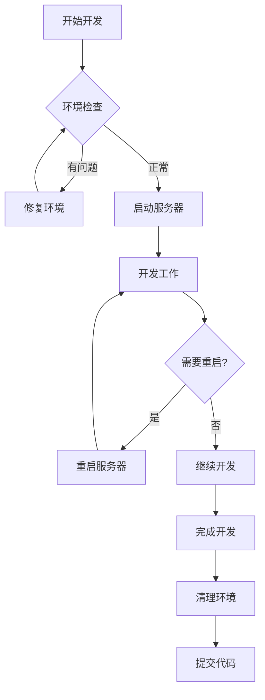

# React+Vite 项目开发工作流标准化指南

## 🎯 目标

建立可靠、可重复的开发环境启动流程，彻底解决端口占用和进程管理问题。

## 📋 标准开发流程

### 每日启动流程

**1. 环境准备**
```bash
# 进入项目目录
cd /Users/lujiaxian/APP/Fit/fit-react/fit-react

# 环境健康检查
./scripts/pre-dev-check.sh
```

**2. 安全启动开发服务器**
```bash
# 方法1：智能清理启动（推荐）
npm run dev:clean

# 方法2：使用脚本管理启动
./scripts/dev-cleanup.sh start

# 方法3：指定端口启动
npm run dev:3001
```

**3. 开发过程监控**
```bash
# 查看服务器状态
npm run dev:status

# 需要时重启服务器
npm run dev:restart
```

**4. 开发结束清理**
```bash
# 停止开发服务器
npm run dev:stop

# 或使用脚本
./scripts/dev-cleanup.sh stop
```

### 标准工作流程图



## 🔧 环境管理规范

### 开发环境标准化

**1. 必需工具安装**
```bash
# 检查 Node.js 版本 (≥20)
node --version

# 检查 npm 版本
npm --version

# 安装项目依赖
npm install
```

**2. 配置文件设置**
```bash
# 环境变量配置 (.env.local)
PORT=3000
AUTO_CLEANUP=true
AUTO_OPEN=false
NODE_ENV=development
```

**3. Git钩子设置**
```bash
# 安装pre-commit钩子
cp scripts/pre-commit-check.sh .git/hooks/pre-commit
chmod +x .git/hooks/pre-commit
```

### 端口管理策略

**端口分配规则：**
- 3000: 主开发服务器
- 3001: 备用开发服务器
- 3002: 测试环境
- 4173: 预览服务器

**端口冲突解决：**
```bash
# 自动查找可用端口
./scripts/dev-cleanup.sh start

# 手动指定端口
npm run dev:3001

# 清理冲突端口
./scripts/dev-cleanup.sh stop
```

## 👥 团队协作规范

### 代码开发规范

**1. 分支管理**
```bash
# 创建功能分支
git checkout -b feature/new-feature

# 开发完成后提交
git add .
git commit -m "feat: implement new feature"
git push origin feature/new-feature
```

**2. 开发服务器使用**
- ✅ 每个人使用不同的端口避免冲突
- ✅ 开发结束后及时清理服务器进程
- ✅ 使用脚本管理而非直接 `npm run dev`
- ❌ 避免同时运行多个开发服务器实例

**3. 环境一致性**
```bash
# 使用Docker确保环境一致
docker-compose -f docker-compose.dev.yml up

# 或使用npm脚本
npm run dev:clean  # 保证环境清理后启动
```

### 日常维护规范

**每日检查清单：**
- [ ] 开发服务器状态正常
- [ ] 端口无冲突
- [ ] TypeScript编译无错误
- [ ] Git工作区干净
- [ ] 依赖项为最新版本

**每周维护任务：**
```bash
# 深度清理开发环境
npm run cleanup:deep

# 更新依赖包
npm update

# 检查安全漏洞
npm audit fix
```

## 🚨 故障处理流程

### 常见问题解决方案

**问题1：端口持续占用**
```bash
# 1. 查看占用进程
lsof -ti:3000

# 2. 智能清理
./scripts/dev-cleanup.sh stop

# 3. 强制清理
./scripts/dev-cleanup.sh clean

# 4. 重启系统（最后手段）
sudo reboot
```

**问题2：热重载失效**
```bash
# 1. 清理Vite缓存
rm -rf node_modules/.vite

# 2. 重新安装依赖
npm run cleanup:deep
npm install

# 3. 重启开发服务器
npm run dev:clean
```

**问题3：TypeScript编译错误**
```bash
# 1. 详细错误检查
npx tsc --noEmit

# 2. 检查类型定义
npx tsc --noEmit --skipLibCheck

# 3. 修复后重启
npm run dev:restart
```

### 应急处理流程

**完全环境重置：**
```bash
# 1. 停止所有开发服务器
./scripts/dev-cleanup.sh clean

# 2. 深度清理
npm run cleanup:deep

# 3. 重新安装依赖
rm -rf node_modules package-lock.json
npm install

# 4. 重新初始化
./scripts/pre-dev-check.sh
npm run dev:clean
```

## 📊 监控和报告

### 开发环境监控

**实时监控脚本：**
```bash
#!/bin/bash
# monitor-dev.sh - 开发环境监控

while true; do
    clear
    echo "🔍 开发环境状态监控"
    echo "===================="
    echo "时间: $(date)"
    echo ""

    # 端口状态
    echo "📡 端口状态:"
    for port in 3000 3001 3002 4173; do
        if lsof -ti:$port >/dev/null 2>&1; then
            echo "  ✅ 端口 $port: 运行中"
        else
            echo "  ❌ 端口 $port: 空闲"
        fi
    done

    echo ""
    # 进程状态
    echo "⚡ Node.js 进程:"
    ps aux | grep -E "(vite|node)" | grep -v grep | wc -l | xargs -I {} echo "  活跃进程数: {}"

    echo ""
    # 内存使用
    echo "💾 内存使用:"
    free -h | grep "Mem:" | awk '{print "  使用: " $3 " / " $2}'

    sleep 5
done
```

**日志分析：**
```bash
# 查看开发服务器日志
tail -f /tmp/vite-fit-react.log

# 查看系统资源使用
top -p $(lsof -ti:3000)

# 网络连接检查
netstat -an | grep :3000
```

### 性能优化建议

**开发服务器优化：**
- 使用SSD存储提升文件监听性能
- 增加系统内存避免频繁GC
- 使用最新Node.js版本获得性能提升
- 定期清理npm缓存：`npm cache clean --force`

**代码优化：**
- 避免在组件中进行复杂计算
- 使用React.memo优化重渲染
- 合理使用Vite的代码分割功能
- 配置适当的开发代理减少跨域请求

## 📈 持续改进

### 工作流优化指标

**关键指标监控：**
- 开发服务器启动时间
- 热重载响应时间
- 端口冲突发生频率
- 环境清理成功率

**改进建议收集：**
- 定期收集团队反馈
- 监控新问题和解决方案
- 更新文档和脚本工具
- 分享最佳实践和经验

### 技术债务管理

**定期评估：**
- 依赖项安全漏洞检查
- 构建工具版本更新
- 配置文件优化机会
- 开发工具性能瓶颈

**自动化改进：**
- 增强脚本错误处理
- 添加更多环境检查项
- 实现自动故障恢复
- 集成更多开发工具

---

**文档版本：1.0**
**最后更新：2025-10-27**
**维护者：Jason Lu**
**审核状态：待团队审核**