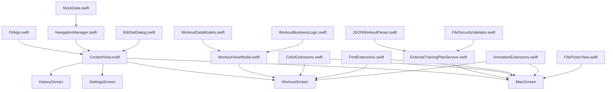
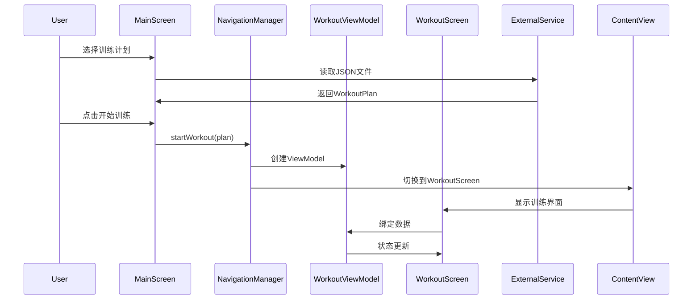
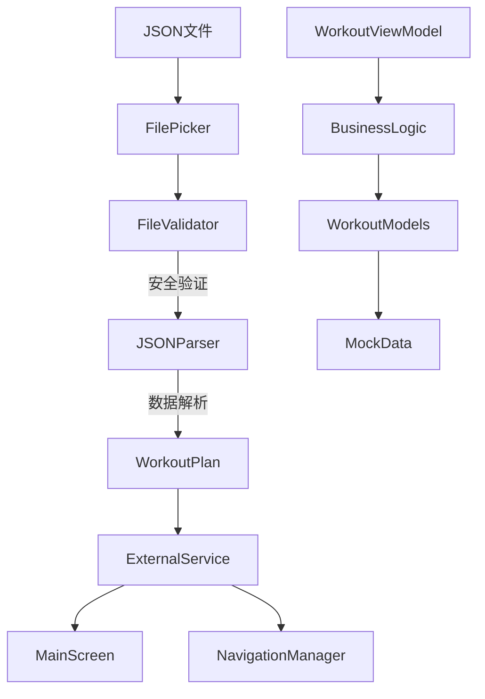
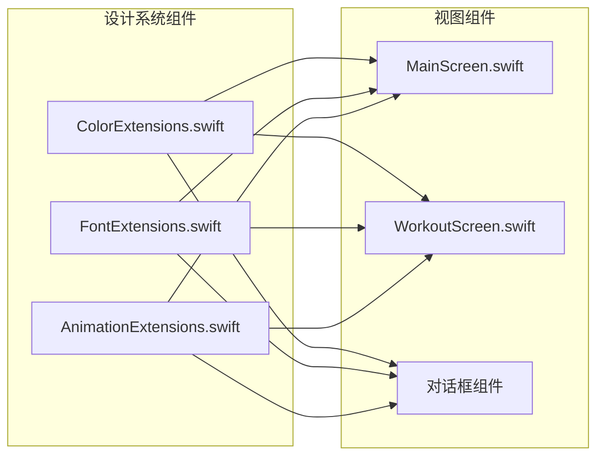
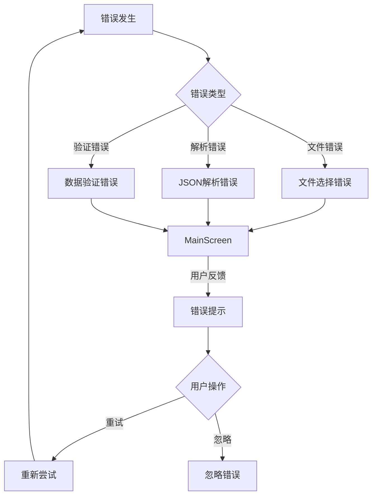

# Fit iOS 应用组件关系图

## 组件依赖关系概览



## 详细组件关系说明

### 1. 应用启动流程

```
FitApp (App Entry)
    ↓
NavigationManager (初始化)
    ↓
ContentView (主视图容器)
    ↓
MainScreen (默认显示)
```

**关键依赖关系**:
- `FitApp` 创建并注入 `NavigationManager` 作为环境对象
- `ContentView` 监听 `NavigationManager` 的状态变化
- `MainScreen` 作为默认主界面显示

### 2. 导航管理依赖

```mermaid
graph LR
    NavigationManager -->|@Published currentScreen| ContentView
    NavigationManager -->|@Published presentedDialog| ContentView
    NavigationManager -->|@Published currentWorkoutViewModel| WorkoutScreen

    MainScreen -->|navigationManager.startWorkout()| NavigationManager
    WorkoutScreen -->|navigationManager.quitWorkout()| NavigationManager
```

**核心交互**:
- **状态驱动导航**: `NavigationManager` 通过 `@Published` 属性驱动界面切换
- **ViewModel 生命周期**: `NavigationManager` 管理 `WorkoutViewModel` 的创建和销毁
- **对话框管理**: 统一的对话框显示和隐藏机制

### 3. 训练流程组件关系



### 4. 数据处理流程



**数据处理关键点**:
- **文件验证**: `FileSecurityValidator` 确保文件安全性和格式正确性
- **JSON解析**: `JSONWorkoutParser` 将 JSON 数据转换为 Swift 对象
- **业务逻辑**: `WorkoutBusinessLogic` 提供核心计算和验证功能
- **数据模型**: `MockData` 和 `WorkoutDataModels` 提供数据结构定义

### 5. 状态管理依赖关系

```mermaid
graph TB
    subgraph "状态管理中心"
        NavigationManager[NavigationManager]
        WorkoutViewModel[WorkoutViewModel]
        ExternalService[ExternalService]
    end

    subgraph "视图层"
        ContentView[ContentView]
        MainScreen[MainScreen]
        WorkoutScreen[WorkoutScreen]
    end

    subgraph "数据层"
        MockData[MockData]
        WorkoutModels[WorkoutDataModels]
        BusinessLogic[WorkoutBusinessLogic]
    end

    NavigationManager -->|@Published| ContentView
    WorkoutViewModel -->|@Published| WorkoutScreen
    ExternalService -->|@Published| MainScreen

    WorkoutViewModel --> BusinessLogic
    BusinessLogic --> WorkoutModels
    NavigationManager --> MockData
```

### 6. 设计系统依赖



**设计系统特点**:
- **模块化**: 每个设计方面独立管理
- **一致性**: 统一的视觉风格和交互模式
- **可复用**: 设计组件可在多个视图中使用

### 7. 错误处理和恢复流程



## 组件通信模式

### 1. 观察者模式 (Observer Pattern)
- **实现方式**: `ObservableObject` + `@Published`
- **应用场景**: ViewModel 与 View 之间的数据绑定
- **优势**: 自动响应式更新，减少手动同步代码

### 2. 依赖注入模式 (Dependency Injection)
- **实现方式**: 环境对象 (`@EnvironmentObject`)
- **应用场景**: NavigationManager 在视图层级中的传递
- **优势**: 松耦合，便于测试和维护

### 3. 委托模式 (Delegate Pattern)
- **实现方式**: 回调函数和闭包
- **应用场景**: 文件选择器、对话框交互
- **优势**: 清晰的责任分离

### 4. 策略模式 (Strategy Pattern)
- **实现方式**: 服务接口和多态实现
- **应用场景**: 不同的文件解析策略
- **优势**: 算法可替换，易于扩展

## 组件生命周期管理

### 1. 应用级别
```
FitApp 启动
    ↓
NavigationManager 初始化
    ↓
ContentView 显示
    ↓
用户交互 → 应用终止
```

### 2. 训练会话级别
```
开始训练
    ↓
WorkoutViewModel 创建
    ↓
WorkoutScreen 显示
    ↓
训练进行/暂停/完成
    ↓
训练结束 → ViewModel 销毁
```

### 3. 文件处理级别
```
文件选择
    ↓
FilePicker 显示
    ↓
文件验证和解析
    ↓
数据处理完成/错误
    ↓
FilePicker 关闭
```

## 性能优化考虑

### 1. 视图优化
- **按需加载**: 只在需要时创建和显示视图
- **视图复用**: 避免不必要的视图重建
- **动画优化**: 使用硬件加速的动画效果

### 2. 内存管理
- **弱引用**: 避免循环引用导致的内存泄漏
- **及时清理**: 在适当时机清理计时器和监听器
- **对象池**: 复用频繁创建的对象

### 3. 数据处理优化
- **异步处理**: 在后台线程处理复杂的数据操作
- **增量更新**: 只更新变化的数据部分
- **缓存机制**: 缓存常用的计算结果

---

*文档版本: 1.0*
*最后更新: 2025年10月13日*